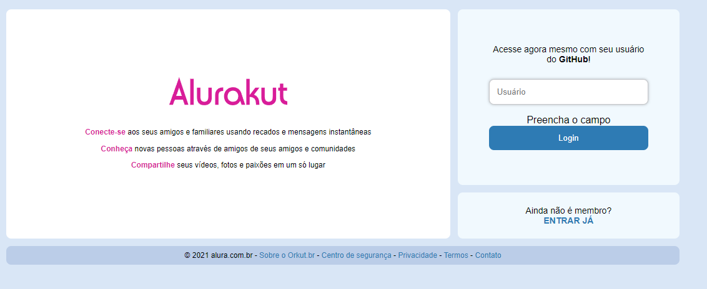
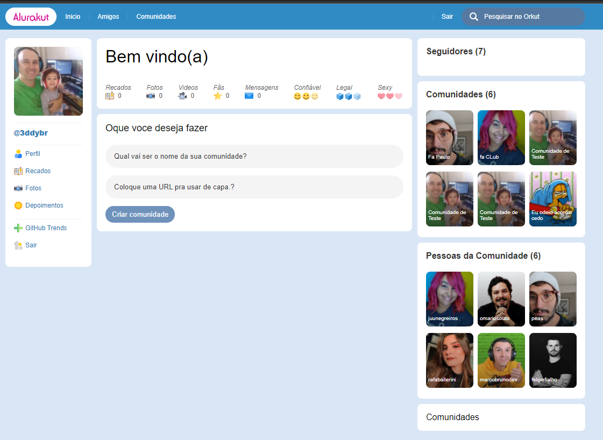

<h1 align="center">Alurakut</h1>

## 👇 Sobre o projeto

Projeto com a ideia de representar o nostálgico Orkut. Realizado durante a **Imersão React** oferecido pela **[Alura](https://www.alura.com.br/)**.



<br/>


---## 💻 Tecnologias

As seguintes tecnologias foram utilizadas na construção do projeto:

- **[React](https://pt-br.reactjs.org/)**
- **[ESLint](https://eslint.org/)**
- **[Next.js](https://nextjs.org/)**
- **[Nookies](https://github.com/maticzav/nookies)**
- **[Datocms-client](https://github.com/datocms/js-datocms-client)**
- **[Jsonwebtoken](https://www.npmjs.com/package/jsonwebtoken)**
- **[Styled Components](https://styled-components.com/)**
> Veja o arquivo **[package.json](https://github.com/Brendhon/alurakut/blob/main/package.json)**
### Utilitários
- Editor: **[Visual Studio Code](https://code.visualstudio.com/)**

---

## 👨‍💻 Como executar o projeto

### 💡 Pré-requisitos

Antes de começar, você vai precisar ter instalado em sua máquina as seguintes ferramentas:
**[Git](https://git-scm.com)** e **[Node.js](https://nodejs.org/en/)**.

```bash
# Clone este repositório
$ git clone https://github.com/3ddybr/alurakut.git
# Na raiz do projeto instale as dependências
$ npm install
```

Com isso o projeto já estará pronto para ser executado.

### ⚽ Rodando no modo desenvolvedor

```bash